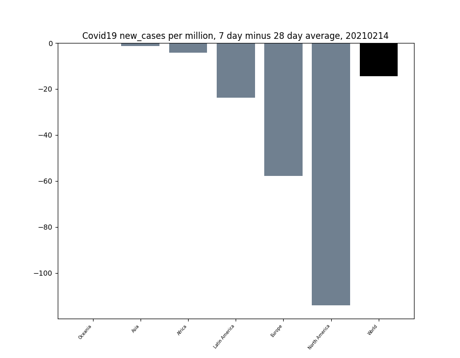

Covid19 Data Visualisation in Python

ourworldindata.org offers an updated csv file which can easily be extracted for analysis on this subject. 

Using Python and the Seaborn module, we can plot a correlation heatmap of some of the key data indicators on a country by country basis.  This chart, using data as of mid February 2021, highlights some key correlations.  Namely the total cases correlates strongly with total tests.  Total tests seems strongly correlated with gdp per capita suggesting it may be the case that extent of the Covid crisis so far, may have actually been understated in the developing world, particularly in Africa as shown in the subsequent scatter plot.  

Although the vaccination programmes are in the early stages, it suggests there is a similar strong correlation between vaccinations and gdp per capita suggesting something of a possible divide between access to the vaccine for rich and poor countries.  It is also interesting from this data that mortality, defined as number of deaths divided by number of cases seems largely uncorrelated between the variables considered here.

 

This tool also looks at the relative moving average of key Covid19 fields such as New Cases, New Deaths etc at a point in time to hopefully give some insight into the stages countries, regions and subregions are currently at.  The charts below are looking at the 7 to 28 day moving average window of new cases as an example.  It seems that there is some daily seasonality associated with the release of new data with some countries seemingly releasing multiple days of data in a single day, therefore a minimum moving average term of 7 days is probably the lowest bound that should be considered.  

It seems that the common pattern of pandemics within countries is to see new cases grow rapidly (almost exponentially in some cases) in the early stages before levelling off and eventually falling, which is what we are currently seeing at this time.

